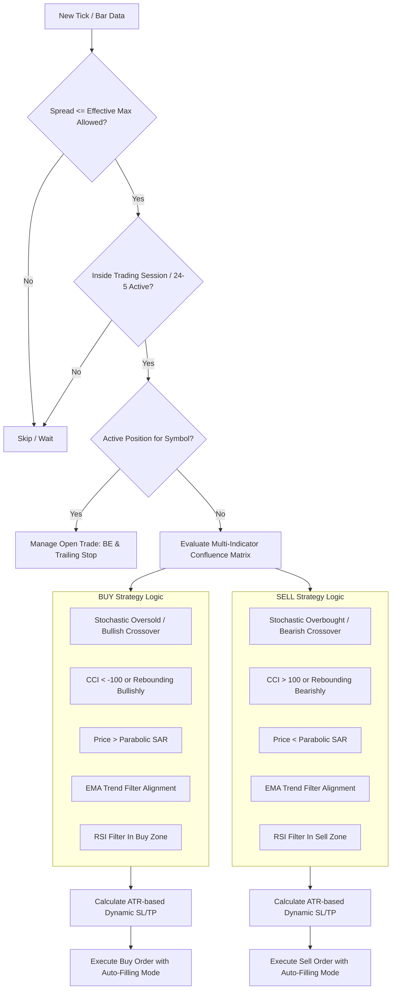

# 🚀 IJESHA ALGO EA v2.2 (MetaTrader 5)

[](https://www.mql5.com/)
[](https://www.metatrader5.com/)
[](https://github.com/Shifrozy/IJESHA-MT5-EA)
[](https://github.com/Shifrozy/IJESHA-MT5-EA)
[](LICENSE)

An institutional-grade, aggressive **MetaTrader 5 Expert Advisor (EA)** engineered with multi-layer trend-momentum confirmation, adaptive volatility sizing, dynamic ATR-based risk controls, break-even protection, trailing stop mechanisms, broker-adaptive spread management, and an interactive real-time HUD dashboard.

---

## 📌 Key Highlights & System Architecture

- ⚡ **Multi-Indicator Confluence Matrix**:
  - **Stochastic Oscillator** (%K 14, %D 3, Slowing 3) — Cycle extremes & momentum crossovers.
  - **Commodity Channel Index (CCI 14)** — Trend strength & overbought/oversold boundaries (`±100`).
  - **Parabolic SAR** (Step 0.02, Max 0.20) — Dynamic trailing direction and stop confirmation.
  - **Exponential Moving Averages (EMA 50 & EMA 21 Fast)** — Macro & intermediate trend alignment.
  - **Relative Strength Index (RSI 14)** — Exhaustion & momentum filtering.
  - **Average True Range (ATR 14)** — Volatility-adapted dynamic Stop Loss & Take Profit calculation.

- 🛡️ **Autonomous Trade Protection & Risk Management**:
  - **Auto-Adaptive Spread Filter**: Symbol-aware spread limits (50-100 pts for Forex, 300-500 pts for Gold `XAUUSD`) to ensure zero missed trades.
  - **Fixed Lot Sizing**: Optimized for consistent account scaling (`0.02` default or user-defined).
  - **Single Position Rule**: Enforces 1 active position per symbol to eliminate over-exposure.
  - **Break-Even Trigger**: Moves Stop Loss to Entry + Profit Offset after `30 points` gain.
  - **Smart Trailing Stop**: Activates at `50 points` profit with a `15 points` step for maximum profit retention.
  - **Broker Filling Mode Autodetection**: Dynamically chooses `FOK`, `IOC`, or `RETURN` based on broker specifications.

- 📊 **Interactive On-Chart Visual GUI**:
  - Live HUD Dashboard displaying live indicator states, spread, trend bias, and P/L.
  - Real-time **Divergence Line Visualizer** drawn directly on candlesticks for visual confirmation.

---

## 🏗️ Algorithmic Confluence Workflow



---

## ⚙️ Strategy Specification

### 🟢 Long (Buy) Signal Confluence:
1. **Stochastic Oscillator**: Main line `< 20` (Oversold condition) OR recent crossover (%K > %D).
2. **CCI (14)**: Value `< -100` OR rebounding bullishly from oversold level.
3. **Parabolic SAR**: Price is **above** current SAR level.
4. **EMA Filter**: Price is above EMA 50 (or EMA21/50 alignment based on `InpEMAMode`).
5. **Spread Filter**: Current Market Spread `< EffectiveMaxSpread`.

### 🔴 Short (Sell) Signal Confluence:
1. **Stochastic Oscillator**: Main line `> 80` (Overbought condition) OR recent crossover (%K < %D).
2. **CCI (14)**: Value `> 100` OR rebounding bearishly from overbought level.
3. **Parabolic SAR**: Price is **below** current SAR level.
4. **EMA Filter**: Price is below EMA 50 (or EMA21/50 alignment based on `InpEMAMode`).
5. **Spread Filter**: Current Market Spread `< EffectiveMaxSpread`.

---

## 🛠️ Input Parameters Reference

| Group | Parameter | Default | Description |
| :--- | :--- | :--- | :--- |
| **Trade Settings** | `InpLotSize` | `0.02` | Fixed trading volume |
| | `InpMagicNumber` | `123456` | Unique EA identifier |
| | `InpAutoSpread` | `true` | Auto-adaptive spread limit for Forex & Gold |
| | `InpMaxSpread` | `300` | Maximum allowable spread (Points) |
| | `InpSignalLookback` | `5` | Lookback window for confluence |
| **Stochastic** | `InpStochK` / `D` / `Slowing` | `14` / `3` / `3` | Stochastic oscillator period settings |
| | `InpStochOversold` / `Overbought` | `20.0` / `80.0` | Oversold / Overbought thresholds |
| **CCI** | `InpCCIPeriod` | `14` | Commodity Channel Index period |
| | `InpCCIBuyLevel` / `SellLevel` | `-100.0` / `100.0` | Signal triggering boundaries |
| **ATR Risk** | `InpATRPeriod` | `14` | Volatility evaluation period |
| | `InpSLMultiplier` | `1.5` | Stop Loss multiplier (`SL = ATR * 1.5`) |
| | `InpTPMultiplier` | `2.0` | Take Profit multiplier (`TP = ATR * 2.0`) |
| **Parabolic SAR** | `InpUseSARFilter` | `true` | Enable/Disable SAR validation |
| | `InpSARStep` / `InpSARMax` | `0.02` / `0.20` | Acceleration factor and maximum bound |
| **EMA Trend Filter** | `InpUseEMAFilter` | `true` | Enable/Disable EMA trend validation |
| | `InpEMAMode` | `Price Only` | `0: Price vs EMA50`, `1: EMA Crossover`, `2: Combined` |
| | `InpEMAPeriod` / `FastPeriod` | `50` / `21` | Slow and Fast EMA periods |
| **RSI Filter** | `InpUseRSIFilter` | `false` | Enable/Disable RSI exhaustion filter |
| **Session Filter** | `InpUseSessionFilter` | `false` | Enable/Disable session filter (`false` = 24/5 trading) |
| **Trade Protection** | `InpUseBreakEven` | `true` | Auto-move SL to entry at profit threshold |
| | `InpUseTrailing` | `true` | Auto-trailing stop with broker level compliance |
| **Visuals** | `InpShowDashboard` | `true` | Toggle on-chart HUD panel |
| | `InpDrawDivergence` | `true` | Render on-chart divergence lines |

---

## 📁 Pre-Configured Presets

Pre-optimized parameter sets are included in the `/presets` directory:
- [`presets/EURUSD_M15_Optimized.set`](presets/EURUSD_M15_Optimized.set) — Tailored for EURUSD on 15-minute timeframe.
- [`presets/XAUUSD_M15_Aggressive.set`](presets/XAUUSD_M15_Aggressive.set) — Tailored for Gold (XAUUSD) with volatility scaling and 500-point spread tolerance.

---

## 📥 Installation & Setup Guide

1. **Clone or Download Repository**:
   ```bash
   git clone https://github.com/Shifrozy/IJESHA-MT5-EA.git
   ```

2. **Copy Files to MetaTrader 5**:
   - Open **MetaTrader 5**.
   - Click `File` -> `Open Data Folder`.
   - Navigate to `MQL5/Experts/`.
   - Copy `IJESHA_ALGO_EA.mq5` and `IJESHA_ALGO_EA.ex5` into this folder.

3. **Enable Algorithmic Trading**:
   - In MT5, press `Ctrl + O` to open Options -> **Expert Advisors**.
   - Check **"Allow Algo Trading"**.

4. **Attach to Chart & Load Preset**:
   - In MT5 Navigator (`Ctrl + N`), drag **IJESHA ALGO EA** onto chart (`EURUSD` or `XAUUSD`).
   - Click **Inputs** -> **Load** -> Select corresponding preset file.
   - Click **OK**.

---

## 📄 License & Disclaimer

This project is licensed under the MIT License - see the [LICENSE](LICENSE) file for details.

> **⚠️ Risk Warning:** Trading Forex and CFDs carries high risk and may not be suitable for all investors. Always test on a Demo account before deploying live capital.
